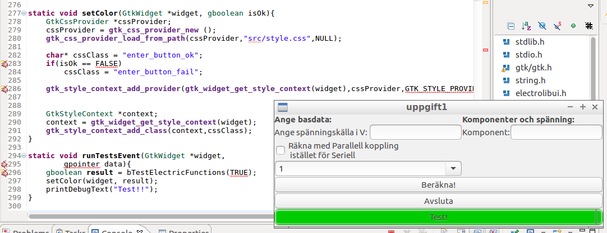

# Övning 12

## Inledning
Uppgiften var att ta det grafiska gränssnittet som byggdes i uppgift 11 med vissa justeringar och få det att fungera i Eclipse som är ett fullständigt IDE(Integrated Development Environment) för C/C++ utveckling. Utmaningen här är att få make strukturen som var helt manuellt skapad i tidigare uppgifter utförd och parametersatt i Eclipse. Fördelen med ett IDE är att det hanterar alla stegen i en utvecklingsprocess så som:
- Skriva kod
- Debugga kod
- Bygga koden
- Länka koden
- osv.

Utmaningar:
- Länka in de egna biblioteken som en *.a fil samt header filer från dessa
- Länka in och inkludera GTK+3
- Rätta buggar i testerna samt eventuella buggar i biblioteken

## Metod
Nedan beskrivs de olika stegen för att få igång programmet i Eclipse.

### Skapa ett arkiv av electro biblioteken för användning i Eclipse
Nedan bör läggas till i make filen för labb 11 för att snabbt kunna deploya ut en ny version av utvecklingsarkivet, jag har kört stegen nedan manuellt vid varje biblioteksändring.
Följande körs under lab6 mappen/foldern:

```bash
make lib
```

Skapa linum.a med:
```bash
ar cr liblinum.a libpower.o libcomponent.o libresistance.o 
```
Kopiera in dem i det centrala biblioteket(för att göra det nåbart från länkningen i Eclipse):
```bash
sudo cp liblinum.a /usr/lib/liblinum.a
```

Kopiera även in header filerna enligt:
```bash
cp Topic6/Labb6/lib/libpower/libpower.h /usr/include/linum/libpower.h

cp Topic6/Labb6/lib/libresistance/libresistance.h /usr/include/linum/libresistance.h 

cp Topic6/Labb6/lib/libcomponent/libcomponent.h /usr/include/linum/libcomponent.h
```

### Flytta över från make strukturen i lab 11
- Kopiera över maingtk.c
- Kopiera över electrolibui.c/h

Ej möjligt att kompilera eller länka efter detta i och med att GTK+3 referenserna för kompilering och länkning inte satts upp, det utförs nedan.

### Sökvägsinställningar för headers och lib
#### GTK+3
- Skapa en global variabel för GTK+-LIBS och sätt den till:
  - ```pkg-config --libs gtk+-3.0```
- Skapa en global variabel för GTK+-FLAGS och sätt den till:
  - ```pkg-config --cflags gtk+-3.0```
- Inkludera CFLAGS i kompileringssinstruktionerna
  - ```${COMMAND} ${GTK+-FLAGS} ${FLAGS} ${OUTPUT_FLAG} ${OUTPUT_PREFIX}${OUTPUT} ${INPUTS}```
- Inkludera LIBS i länkningsinstruktionerna
  - ```${COMMAND} ${FLAGS} ${OUTPUT_FLAG} ${OUTPUT_PREFIX}${OUTPUT} ${INPUTS} ${GTK+-LIBS}```

Efter detta steg så kan allt som rör GTK kompileras. Det går fortfarande inte att köra programmet i och med att linum(electrolib) inte har pekats ut i projektet.

### Linum(Electrolib)
I ett tidgare steg skapades linum.a, den ska nu inkluderas för att kunna få ett fullt körbart program så som det fungerade i labb 11.
- Lägg in header sökvägen för linum till ```/usr/include/linum```, se sektionen som skapar Linum.a
- Lägg in att länkningen ska leta efter ```linum```(Här specas inte lib* eller *.a)

Efter det här steget så kan hela projektet kompileras och köras. Nu är man där man var i slutet av labb 11 fast att man kör den via Eclipse.

### Lägg in test koden
Packa upp testkod från labb siten och flytta in den i src mappen i Eclipse projektet.

Projektet bygger inte här pga. calculate_resistance står som calculate_resistans. Här bytte jag ut alla calculate_resistans mot calculate_resistance, det såg jag som det renaste istället för att ha ett macro som ändrar namnen för att passa testerna.

*Se alla ändringar nedan:*

```diff
18,20c18,20
+ //#ifndef calc_resistance
+ //#define calc_resistance calc_resistans
+ //#endif
---
- #ifndef calc_resistance
- #define calc_resistance calc_resistans
- #endif
60c60
+ 	float fSum = calc_resistance(iLen,S_CHAR,pf);
---
- 	float fSum = calc_resistans(iLen,S_CHAR,pf);
149c149
+ 		float f=calc_resistance( 1, S_CHAR, &af[0]);
---
- 		float f=calc_resistans( 1, S_CHAR, &af[0]);
154c154
+ 		float f=calc_resistance(1, P_CHAR, &af[0]);
---
- 		float f=calc_resistans(1, P_CHAR, &af[0]);
159c159
+ 		float f=calc_resistance(3,P_CHAR,&af[0]);
---
- 		float f=calc_resistans(3,P_CHAR,&af[0]);
164c164
+ 		float f=calc_resistance( 2, P_CHAR, &af[0]);
---
- 		float f=calc_resistans( 2, P_CHAR, &af[0]);
```

Här finns också ett fel i #include sektionen för biblioteken där man refererar till header filerna utan lib*.

*Dessa justerades enligt nedan:*
```diff
10,12c10,12
+ #include <libpower.h>
+ #include <libresistance.h>
+ #include <libcomponent.h>
---
- #include <power.h>
- #include <resistance.h>
- #include <component.h>
```

Efter den här ändringen så bygger projektet.

### Skapa knapp för att köra testerna
Knappen skapades och sattes upp enligt bilden nedan för att få färgerna grön(Ok test) och röd för (falierade test).
 

Css filen som beskriver en röd respektive grön knapp ligger under src mappen med namnet style.css i projektet och ser ut enligt följande:
```css
.enter_button_ok{
    background: #00cc00;
}

.enter_button_fail{
    background: #ff0000;
}
```

### Buggar
Det hittades lite buggar, dessa hittades med hjälp av att köra debuggern i Eclipse.
Buggarna var av två slag:
- Missuppfattning eller överoptimering av bibliotek.
  - Här hade antaganden gjorts som ej stog med i instruktionen i Lab6.
- Fel i test verifieringskoden.
  - Här testade koden fel saker, dessa behövde då justeras.

  Läs om funna buggar samt hur de justerades i sektionen Resultat nedan.

## Resultat

Nedan är de resultat som framkom under utförandet av uppgiften.

### Godkänt test hela tiden
Varje gång testen kördes skrevs det ut att det var godkänt hela tiden, justering gjordes så att resultatet från testet togs med för att besluta om texten för godkänt test skulle skrivas ut eller ej.

*Ändringen skedde enligt nedan:*
```diff
186c186
+ 	if(bShowText && bRet)
---
- 	if(bShowText)
192c192
+ 	if(bShowText && bRet)
---
- 	if(bShowText)
198c198
+ 	if(bShowText && bRet)
---
- 	if(bShowText)
```

### Fel resultat kontrollerat för E12 komponent
Fel i bibliotekskontrollen där man skulle räkna på vila E12 komponenter som skulle användas. Här räckte det med en enligt biblioteket, men test verifieringen ville ha två vilket inte stämmer som jag ser det.

*Ändringen skedde enligt nedan:*
```diff
107c107
+ 	bRet &=(iLen==1);							// Checks that result is E12.
---
- 	bRet &=(iLen==2);							// Checks that result is E12.
```

### Fel i biblioteken
I vissa fall så såg jag i våra bibliotek libcompnent och libpower att vi returnerade -1 i vissa fall. Men så vitt jag kan se så är det bara för libresistance vi ska returnera -1 vid "orimlig" input. Testerna gav fel på vissa lägen där vi skickade in 0 etc. eller negativa belopp.

Jag justerade det direkt i biblioteken så att de skulle möta testerna eftersom testerna ändock verkade rimliga och att instruktionen i lab 6 inte följts map. returkoder.

Att hitta de buggarna krävde dock inte att jag behövde kompilera om med debug symboler eftersom de var relativt enkla att hitta.

Vi hade också en globalvariabel i libpower som störde kompileringen, den fick jag ändra till static eftersom den bara var intressant i den libpower.

### Total diff/ändringar(testfilen)

```diff
10,12c10,12
+ #include <libpower.h>
+ #include <libresistance.h>
+ #include <libcomponent.h>
---
- #include <power.h>
- #include <resistance.h>
- #include <component.h>
18,20c18,20
+ //#ifndef calc_resistance
+ //#define calc_resistance calc_resistans
+ //#endif
---
- #ifndef calc_resistance
- #define calc_resistance calc_resistans
- #endif
60c60
+ 	float fSum = calc_resistance(iLen,S_CHAR,pf);
---
- 	float fSum = calc_resistans(iLen,S_CHAR,pf);
107c107
+ 	bRet &=(iLen==1);							// Checks that result is E12.
---
- 	bRet &=(iLen==2);							// Checks that result is E12.
149c149
+ 		float f=calc_resistance( 1, S_CHAR, &af[0]);
---
- 		float f=calc_resistans( 1, S_CHAR, &af[0]);
154c154
+ 		float f=calc_resistance(1, P_CHAR, &af[0]);
---
- 		float f=calc_resistans(1, P_CHAR, &af[0]);
159c159
+ 		float f=calc_resistance(3,P_CHAR,&af[0]);
---
- 		float f=calc_resistans(3,P_CHAR,&af[0]);
164c164
+ 		float f=calc_resistance( 2, P_CHAR, &af[0]);
---
- 		float f=calc_resistans( 2, P_CHAR, &af[0]);
186c186
+ 	if(bShowText && bRet)
---
- 	if(bShowText)
192c192
+ 	if(bShowText && bRet)
---
- 	if(bShowText)
198c198
+ 	if(bShowText && bRet)
---
- 	if(bShowText)
```

## Diskussion
Resultatet från min sida är att det gick att få det att fungera. Några snesteg med våra enga bibliotek hittades som jag skrev on under bugsektionen i Resultat delen. men överlag så tycker jag det har gått bra. Det som man kan nämna är att felen man får i Eclipse när man har ett misstag som i fallet där vi hade en globalvariabel som länkades in flera gånger är att det är lurigt att fastställa exakt vem som tar in vad och vart dubletten är. Ibland kan jag tycka att det blir lite rörigt att Eclipse genererar en egen makefil men som är "read only"...men fördelarna med IDE:t överväger ju såklart. 

## Slutord
Intressant labb, jag använde Eclipse för 13 år sedan men då var det Java vi körde. Tycker att det överlag funkade bra som sagt, tror att jag har en del fördel av att ha kört Visual Studio sedan tidigare vilket gör det enklare att förstå hur delarna hänger ihop.
Labb 11 hade gått mycket fortare om man fått göra den direkt i Eclipse, framförallt eftersom man kan få autocompleters för metoderna i GTK3. Nu har jag suttit med browsern uppe för att gå igenom deras API referenser för att veta vad jag ska skicka in, blir lite moständigt :-(.

## Referenser

| Länk | Datum |
| ---- | ----- |
| https://developer.gnome.org/gtk3/stable | 2017-04-10 |
| http://www.moodle2.tfe.umu.se/mod/assignment/view.php?id=275 | 2017-04-10 |
| http://stackoverflow.com | 2017-04-10 |
| https://www.tutorialspoint.com/cprogramming/c_operators.htm | 2017-04-10 |